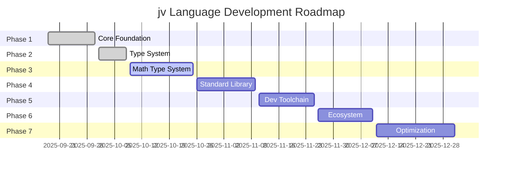

# Development Roadmap

Development roadmap for the jv language. Implementation progresses through 7 phases.

!!! info "Update Information"
    This roadmap is regularly updated. Check individual phase pages for latest progress.

## Development Phase Overview

### Phase 1: Core Language Foundation
**Status**: 🟢 Completed

Implementation of basic syntax parser, AST/IR, Java output, CLI foundation

[View Details](phase1.md){ .md-button }

---

### Phase 2: Type System
**Status**: 🟢 Mostly Complete

Implementation of robust type inference system and null safety analysis

[View Details](phase2.md){ .md-button }

---

### Phase 3: Mathematical Type System + Initial Release
**Status**: 🟡 In Progress

Implementation of mathematical type system and early distribution environment

[View Details](phase3.md){ .md-button }

---

### Phase 4: Standard Library Enhancement
**Status**: ⚪ Not Started

Implementation of comprehensive standard library

[View Details](phase4.md){ .md-button }

---

### Phase 5: Development Toolchain
**Status**: ⚪ Not Started

Implementation of tools to enhance developer experience

[View Details](phase5.md){ .md-button }

---

### Phase 6: Ecosystem Expansion
**Status**: ⚪ Not Started

Package manager and ecosystem development

[View Details](phase6.md){ .md-button }

---

### Phase 7: Advanced Optimization
**Status**: ⚪ Not Started

Performance optimization and advanced features

[View Details](phase7.md){ .md-button }

---

## Overall Timeline

!!! info "Timeline Information"
    - **Actual Period** (Phase 1-2): Actual implementation period from project start to present
    - **Projected Period** (Phase 3+): Estimates based on current development pace (~2 weeks/phase)
    - Subject to change based on actual progress

## Legend

- 🟢 **Completed**: Implementation done, tested
- 🟡 **In Progress**: Currently being implemented
- ⚪ **Not Started**: Planned for future implementation

## Milestones

| Milestone | Target Date | Key Deliverables | Notes |
|-----------|------------|------------------|-------|
| v0.1 Alpha | Late Oct 2025 | Core features + Basic type system | Phase 3 completion |
| v0.3 Beta | Mid Nov 2025 | Standard library + LSP | Phase 5 completion |
| v0.5 RC | Mid Dec 2025 | Package manager | Phase 6 completion |
| v1.0 GA | End Dec 2025 | Production ready | Phase 7 completion |

!!! note "Development Pace"
    Completed Phase 1-2 in ~3 weeks from project start (2025-09-18).
    Projected dates assume maintaining current pace (~2 weeks/phase).

---

## Contributing

For detailed progress and incomplete tasks for each phase, see individual phase pages.
If interested in contributing, please check the [Contributing Guide](../contributing.md).
