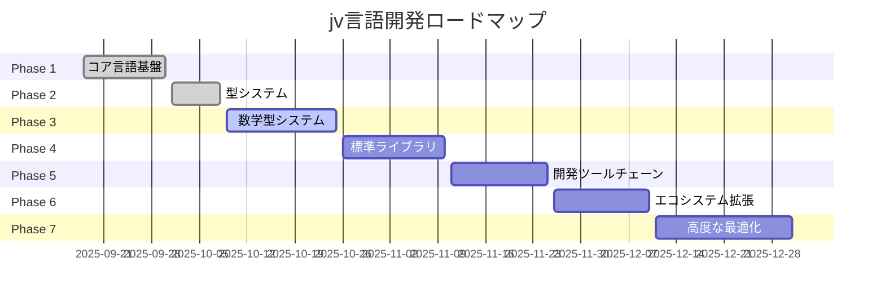

# 開発ロードマップ

jv言語の開発ロードマップです。7つのフェーズに分けて段階的に実装を進めています。

!!! info "更新情報"
    このロードマップは定期的に更新されます。最新の進捗状況は各フェーズのページをご確認ください。

## 開発フェーズ概要

### Phase 1: コア言語基盤
**ステータス**: 🟢 完了

基本的な構文パーサ、AST/IR、Java出力、CLI基盤の実装

[詳細を見る](phase1.md){ .md-button }

---

### Phase 2: 型システム
**ステータス**: 🟢 ほぼ完了

堅牢な型推論システムとnull安全解析の実装

[詳細を見る](phase2.md){ .md-button }

---

### Phase 3: 数学型システム + 初期配布
**ステータス**: 🟡 進行中

数学型システムの実装と早期配布用開発環境の構築

[詳細を見る](phase3.md){ .md-button }

---

### Phase 4: 標準ライブラリ拡充
**ステータス**: ⚪ 未着手

包括的な標準ライブラリの実装

[詳細を見る](phase4.md){ .md-button }

---

### Phase 5: 開発ツールチェーン
**ステータス**: ⚪ 未着手

開発者体験を向上させるツール群の実装

[詳細を見る](phase5.md){ .md-button }

---

### Phase 6: エコシステム拡張
**ステータス**: ⚪ 未着手

パッケージマネージャとエコシステムの構築

[詳細を見る](phase6.md){ .md-button }

---

### Phase 7: 高度な最適化
**ステータス**: ⚪ 未着手

パフォーマンス最適化と高度な機能の実装

[詳細を見る](phase7.md){ .md-button }

---

## 全体タイムライン

!!! info "タイムライン情報"
    - **実績期間**（Phase 1-2）: プロジェクト開始から現在までの実際の実装期間
    - **予測期間**（Phase 3以降）: 現在の開発ペース（約2週間/フェーズ）に基づく予測値
    - 実際の進捗により変動する可能性があります

## 凡例

- 🟢 **完了**: 実装完了、テスト済み
- 🟡 **進行中**: 現在実装中
- ⚪ **未着手**: 今後実装予定

## マイルストーン

| マイルストーン | 予定時期 | 主要成果物 | 備考 |
|--------------|---------|-----------|------|
| v0.1 Alpha | 2025年10月末 | コア機能 + 基本型システム | Phase 3完了時 |
| v0.3 Beta | 2025年11月中旬 | 標準ライブラリ + LSP | Phase 5完了時 |
| v0.5 RC | 2025年12月中旬 | パッケージマネージャ | Phase 6完了時 |
| v1.0 GA | 2025年12月末 | 本番環境対応 | Phase 7完了時 |

!!! note "開発ペースについて"
    プロジェクト開始（2025-09-18）から約3週間で Phase 1-2 を完了しています。
    現在のペース（約2週間/フェーズ）を維持した場合の予測値です。

---

## 貢献について

各フェーズの詳細な進捗状況や未完了タスクについては、個別のフェーズページをご覧ください。
貢献に興味がある方は、[貢献ガイド](../contributing.md)をご確認ください。
